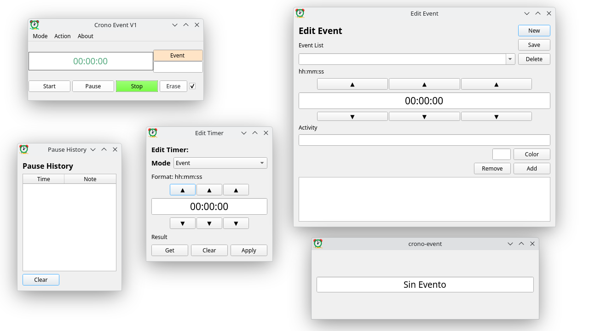
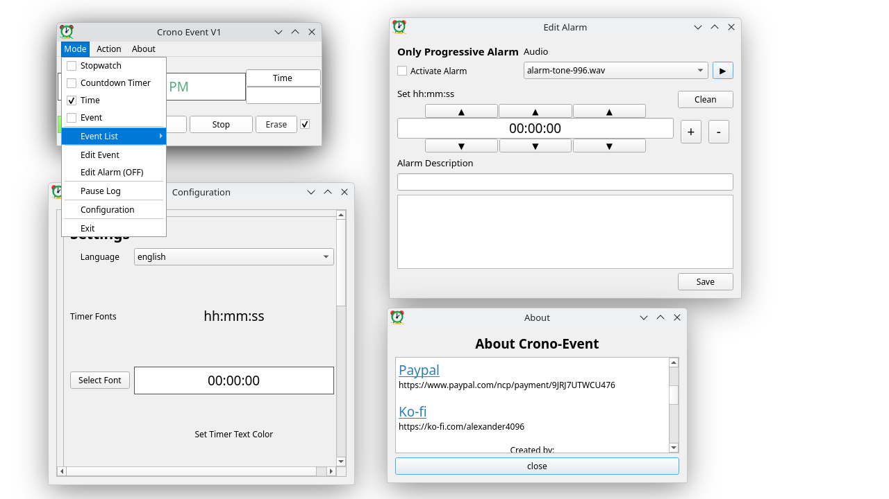
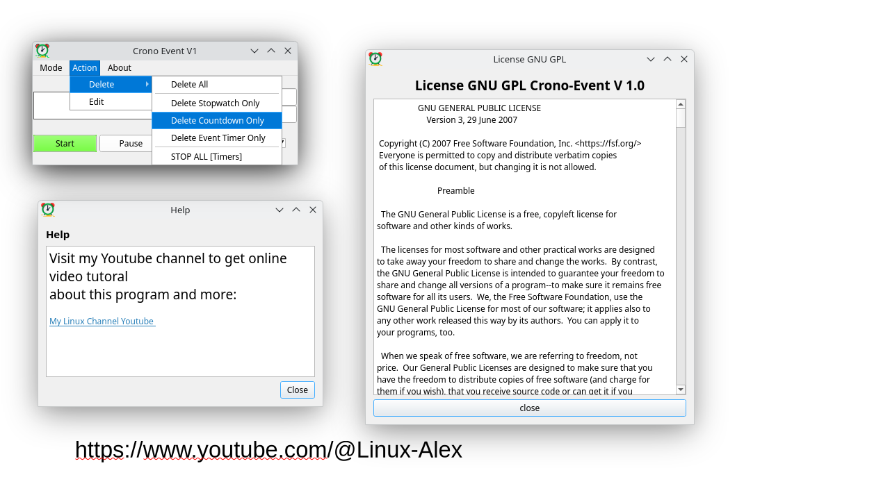
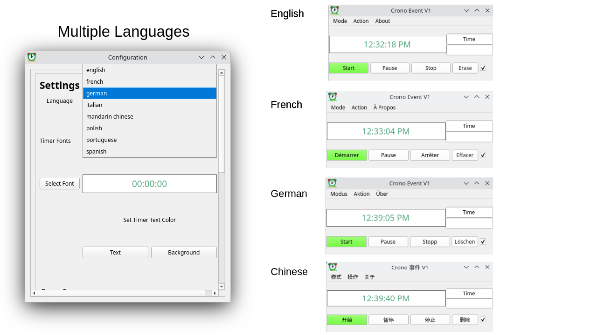

# ⏱️ Crono-Event V1.0.0

**A professional-grade time management suite for the Linux Community.**

Developed with **Python 3.13** and **PyQt6**, Crono-Event is a robust tool designed for high-precision tracking. It is the perfect companion for content creators, professionals, and students who demand accuracy in their daily workflows.

---

## 🚀 Key Features

* **Countdown and Count-up Timer:** Allows you to track the duration of an activity with the option to adjust its start time.
* **Scheduled Alarms with Sound:** Alerts you exactly when to start or finish a specific activity.
* **Event Tracking:** Accurately track time for classes, assignments, presentations, or expositions with a system for storing events.
* **Break History:** Very useful feature to mark the exact moment when you finish or pause an activity.
* **Time in Foreground:** Displaying the time in the foreground is a useful way to track events in OBS or streaming.
* **Multilingual:** Supports 7 languages: Spanish, English, French, Portuguese, German, Italian, and Mandarin Chinese.

---

## 🛠️ Technical Specifications

* **Language:** Python 3.13.
* **UI Framework:** PyQt6 library.
* **Packaging:** High-performance binary version for Linux amd64 created with Nuitka.
* **Target OS:** Linux (Optimized for Debian 13.2 amd64).
* **License:** GNU GPL 3.0 (Open Source).

---

## 📦 Where to get the program

* **GITHUB: Source Code**
  [https://github.com/alexander4096/crono-event](https://github.com/alexander4096/crono-event)

* **GITHUB: Binary version (for linux amd64)**
  [https://github.com/alexander4096/crono-event/releases/tag/1.0.0](https://github.com/alexander4096/crono-event/releases/tag/1.0.0)

* **APPIMAGE / PLING (Utilities, Manage tags, clocks, events)**
  [https://www.pling.com/p/2342534/](https://www.pling.com/p/2342534/)

* **SNAPCRAFT: crono-event**
  [https://snapcraft.io/crono-event](https://snapcraft.io/crono-event)

---

## 💻 For Developers

The application stores configuration files in the standard Linux directory:
`~/.config/crono-event`

### Installation
To run from source:
1. Ensure Python 3.13 or higher is installed.
2. Install the necessary dependencies:
   ```bash
   pip install -r requirements.txt


---

## ❤️ Support the Project

Crono-Event is free and open-source. If this tool adds value to your work, please consider supporting its development:

* **[Donate via PayPal](https://www.paypal.com/ncp/payment/9JRJ7UTWCU476)**
* **[Support on Ko-fi](https://ko-fi.com/alexander4096)**

---

## 📺 Tutorials & Community

Visit my YouTube channel for online video tutorials about this program and more:
**[My Linux Channel Youtube](https://www.youtube.com/@Linux-Alex)**

**Creator:** Alexander Rodriguez  
**Email:** [alexander1973r@gmail.com](mailto:alexander1973r@gmail.com)

---

## 📸 Screenshots








